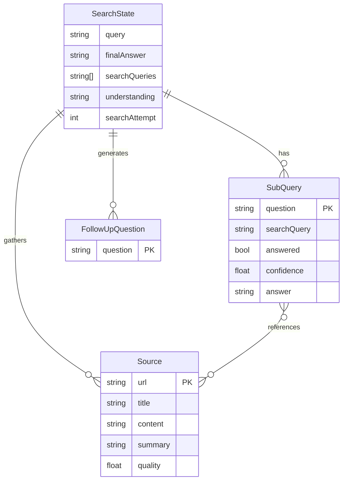

# Codebase Entity-Relationship Diagram (ERD)

This document provides an Entity-Relationship Diagram (ERD) that visualizes the main data models defined within the Firesearch codebase. The diagram is generated using Mermaid.

### Explanation of Entities and Relationships

*   **`SearchState`**: This is the central entity representing a single user query and its entire lifecycle. It holds the initial query, the final synthesized answer, and tracks the overall progress.

*   **`SubQuery`**: A `SearchState` is broken down into one or more `SubQuery` entities. Each `SubQuery` represents a specific factual question that needs to be answered to fulfill the user's original request.
    *   **Relationship**: `SearchState` has a one-to-many relationship with `SubQuery`.

*   **`Source`**: This entity represents a web page that has been identified as a potential source of information. It stores the URL, title, and the processed content/summary of the page.
    *   **Relationship**: `SearchState` gathers many `Source` entities during its execution.

*   **`FollowUpQuestion`**: After a search is complete, the system generates several `FollowUpQuestion` entities to suggest next steps for the user.
    *   **Relationship**: `SearchState` generates one or more `FollowUpQuestion`s.

*   **`SubQuery` and `Source` Relationship**: A many-to-many relationship exists between `SubQuery` and `Source`. A single `SubQuery` can be answered by multiple sources, and a single `Source` can help answer multiple `SubQuery`s. The diagram shows this as "references," as the `SubQuery`'s `sources` field is an array of URLs that point to the `Source` entities. 