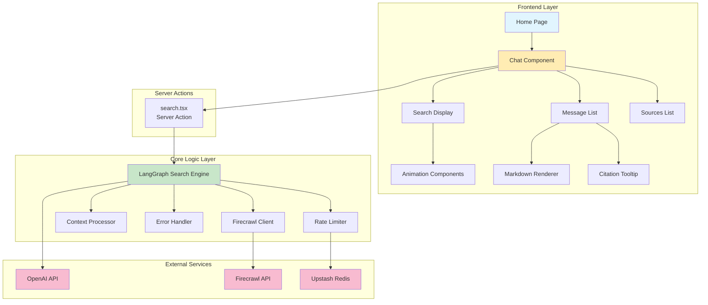
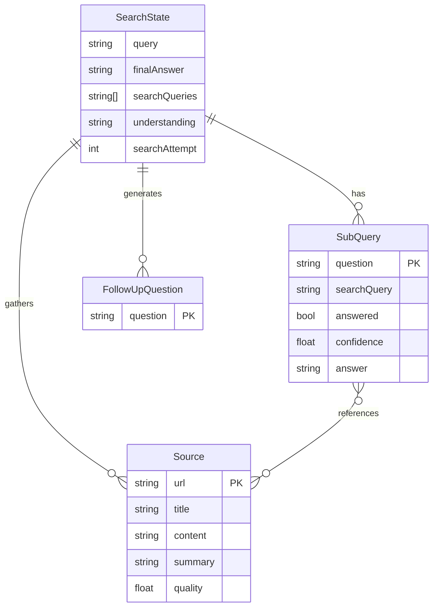
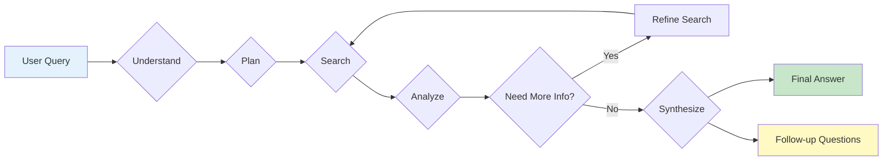

# Unified Firesearch Codebase Analysis

This document consolidates insights from multiple analysis tools and perspectives on the Firesearch codebase.

## 1. Project Overview

**Firesearch** is a sophisticated AI-powered search application built with:
- **Next.js 15** with App Router and React Server Components
- **React 19** for the UI layer
- **LangGraph** for orchestrating multi-step search workflows
- **Firecrawl** for web scraping and content extraction
- **OpenAI API** (GPT-4o & GPT-4o-mini) for intelligent processing
- **Tailwind CSS** and **shadcn/ui** for styling and components

## 2. Architecture Analysis

### 2.1 System Architecture Diagram



### 2.2 Core Components Map

Based on the chunk analysis files, the main components are:

**Frontend Components:**
- `Home` - Landing page component
- `Chat` - Main chat interface managing conversation state
- `SourcesList` - Displays sources found during search
- `SearchDisplay` - Visualizes real-time search progress with animations
- `CitationTooltip` - Handles citation tooltips
- `MarkdownRenderer` - Renders markdown content

**Backend/Core Logic:**
- `LangGraphSearchEngine` - The heart of the application, orchestrating the entire search process
- `FirecrawlClient` - Client for web scraping API
- `ContextProcessor` - Processes and summarizes scraped content

### 2.3 Data Flow and Relationships (from ERD)



Key insights:
- The system breaks down complex queries into manageable SubQueries
- Each SubQuery can reference multiple Sources
- Sources can contribute to multiple SubQueries
- This enables comprehensive, multi-faceted answers

## 3. Code Structure Analysis

### 3.1 Directory Organization
```
firesearch/
├── app/                    # Next.js App Router pages and components
│   ├── api/               # API routes
│   ├── chat.tsx           # Main chat interface (30KB - needs refactoring)
│   ├── search-display.tsx # Search progress visualization (37KB)
│   └── search.tsx         # Server action bridge
├── components/ui/         # Reusable shadcn/ui components
├── lib/                   # Core business logic
│   ├── langgraph-search-engine.ts # Main orchestration (49KB)
│   ├── firecrawl.ts      # Web scraping client
│   └── context-processor.ts # Content processing
└── public/               # Static assets
```

### 3.2 Symbol Analysis Summary

Total symbols identified: **126 unique symbols**

**Distribution by type:**
- Functions: ~65 (UI components, utilities)
- Classes: 3 (FirecrawlClient, ContextProcessor, LangGraphSearchEngine)
- Methods: ~35 (class methods)
- Interfaces/Types: ~20 (TypeScript definitions)
- Enums: 1 (ErrorType)

**Key observations:**
- Heavy use of functional components (React pattern)
- Well-typed with TypeScript interfaces
- Clear separation between UI and business logic

## 4. Search Engine Workflow (from LangGraph Analysis)

### 4.1 Search Process Flow



### 4.2 Phase Details

The search process follows these phases:
1. **Understand** - Analyze user query and extract context
2. **Plan** - Break down into SubQueries and search strategies
3. **Search** - Execute web searches and gather sources
4. **Analyze** - Process and summarize content, check answers
5. **Synthesize** - Generate final answer and follow-up questions

Each phase emits events that the frontend can display in real-time.

## 5. Identified Issues and Refactoring Opportunities

### 5.1 Component Complexity
- `chat.tsx` (30KB) is too large and handles too many responsibilities
- `search-display.tsx` (37KB) could benefit from component extraction

### 5.2 State Management
- Currently using local React state (useState)
- Would benefit from centralized state management (Zustand/Jotai)

### 5.3 Empty Analysis Files
- No usages found for 'Agent', 'Firecrawl', or 'langgraphSearch' symbols
- Suggests these might be outdated search terms or the analysis tools need adjustment

### 5.4 Prompt Management
- Prompts are embedded within `langgraph-search-engine.ts`
- Should be extracted to a separate file for easier management

## 6. Technical Debt and Improvements

### 6.1 Immediate Priorities
1. **Refactor chat.tsx** into smaller components:
   - MessageList
   - MessageInput
   - ApiKeyModal
   - Suggestions

2. **Extract prompts** from langgraph-search-engine.ts

3. **Implement proper state management**

### 6.2 Future Enhancements
- User authentication and session management
- Search history persistence
- Response caching layer
- Comprehensive test suite
- Performance monitoring

## 7. Developer Guidance Summary

**Key files to understand:**
- `lib/langgraph-search-engine.ts` - Core search logic
- `app/chat.tsx` - Main UI interaction point
- `lib/context-processor.ts` - Content processing logic

**Common modification points:**
- Search flow: Edit the StateGraph in langgraph-search-engine.ts
- UI changes: Modify components in app/ directory
- Styling: Update globals.css and tailwind.config.ts
- AI behavior: Adjust prompts and model parameters

## 8. Performance Considerations

**Large files identified:**
- search-display.tsx (37KB)
- chat.tsx (30KB)
- langgraph-search-engine.ts (49KB)

These should be priority targets for code splitting and optimization.

## 9. Security and Configuration

- API keys are handled client-side (consider server-side management)
- Rate limiting is implemented via Upstash
- Environment variables properly configured for Vercel deployment

## 10. Key Metrics Summary

### 10.1 Codebase Statistics
- **Total Files**: ~60 files
- **Total Symbols**: 126 identified symbols
- **Largest Files**: 
  - langgraph-search-engine.ts (49KB)
  - search-display.tsx (37KB)  
  - chat.tsx (30KB)
- **UI Components**: 65+ functional components
- **Core Classes**: 3 (FirecrawlClient, ContextProcessor, LangGraphSearchEngine)

### 10.2 Technology Stack Summary
- **Frontend**: Next.js 15, React 19, Tailwind CSS, shadcn/ui
- **State Management**: React useState (needs upgrade)
- **Backend**: LangGraph, Firecrawl API, OpenAI API
- **Infrastructure**: Vercel, Upstash Redis
- **Language**: TypeScript throughout

### 10.3 Analysis Tools Used
- **Symbol Analysis**: Extracted 126 symbols across all files
- **Chunk Analysis**: Identified component boundaries and relationships
- **ERD Generation**: Mapped data model relationships
- **File Tree Analysis**: Documented complete project structure
- **Usage Analysis**: Searched for symbol references (found gaps)

## 11. Conclusion

Firesearch is a well-architected application with clear separation of concerns, but it's reaching a complexity threshold where refactoring would significantly improve maintainability. The core search engine logic is sophisticated and well-implemented, while the UI layer needs modularization to support future growth.

The analysis reveals a mature codebase that would benefit from:
1. Component-based refactoring (especially chat.tsx and search-display.tsx)
2. Centralized state management implementation
3. Extracted configuration and prompts
4. Enhanced developer documentation
5. Performance optimizations for large components
6. Comprehensive test coverage

This unified analysis provides a comprehensive view of the codebase's current state and a clear path forward for improvements. The combination of multiple analysis tools has revealed both the strengths (clear architecture, good typing) and areas for improvement (component size, state management) in the Firesearch application. 